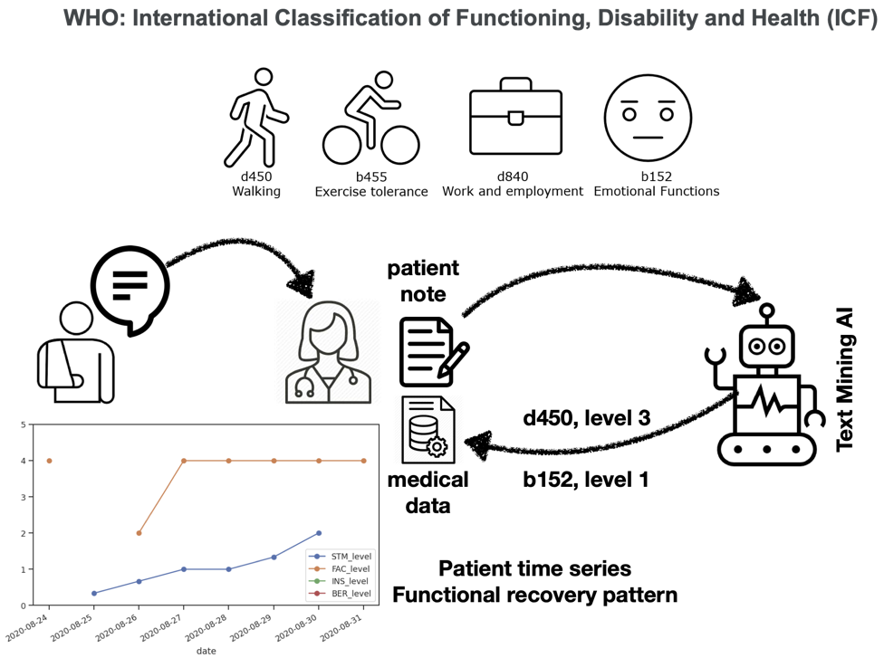

## Welcome to A-PROOF: Automated Prediction of post-COVID RecOvery Of Functioning

A-proof is a collaboration of medical and AI researchers to develop technology that can automatically montitor the functioning of people in need of health care.

### Project code:

<ul>
    <li> Pilot-project: https://github.com/cltl/a-proof </li>
    <li> ZonMW project: https://github.com/cltl/a-proof-zonmw </li>
    <li> Classifier:</li>
    <ul>
        <li> Github: https://github.com/cltl/aproof-icf-classifier </li>
        <li> Docker: https://hub.docker.com/r/piekvossen/a-proof-icf-classifier </li>
    </ul>
</ul>
    
### Publications

<ul>
    <li> Kim J, Verkijk S, Geleijn E, Van der Leeden M, Meskers CGM, Meskers CJW, Van der Veen S, Vossen PJTM, Widdershoven GAM, Modeling Dutch Medical Texts for Detecting Functional Categories and Levels of COVID-19 Patients, Proceedings of the Language Resources and Evaluation Conference (LREC), 2022, Marseille. </li>
    <li> Meskers CGM, van der Veen S, Kim J, Meskers CJW, Smit QTS, Verkijk S, Geleijn E, Widdershoven GAM, Vossen PTJM, van der Leeden M. Automated recognition of functioning, activity and participation in COVID-19 from electronic patient records by natural language processing: a proof- of- concept. Ann Med. 2022 Dec;54(1):235-243 </li>
    <li> Verkijk S, and Vossen PJTM, “Medroberta.nl: a language model for dutch electronic health records,” Computational linguistics in the Netherlands journal, vol. 11, 2021 </li>
</ul>

### The A-PROOF team:

<ul>
    <li> Marike van der Leeden, Sabina van der Veen, Edwin Geleijn, Carel Meskers, Guy Widdershoven (VU-UMC) </li>
    <li> Piek Vossen, Mark Hoogendoorn (VU) </li>
    <li> Students: Gianluca Truda, Stella Verkijk, Caroline Meskers, Quirine Smit, Jenia Kim, Jasper Opsomer, Quinten Vervaart , Luca Bos, Nienke Swartjes, Stella Avelli, Joey Katsburg, Hannah van der Pas </li>
</ul>

For questions, please contact: piek.vossen@vu.nl
